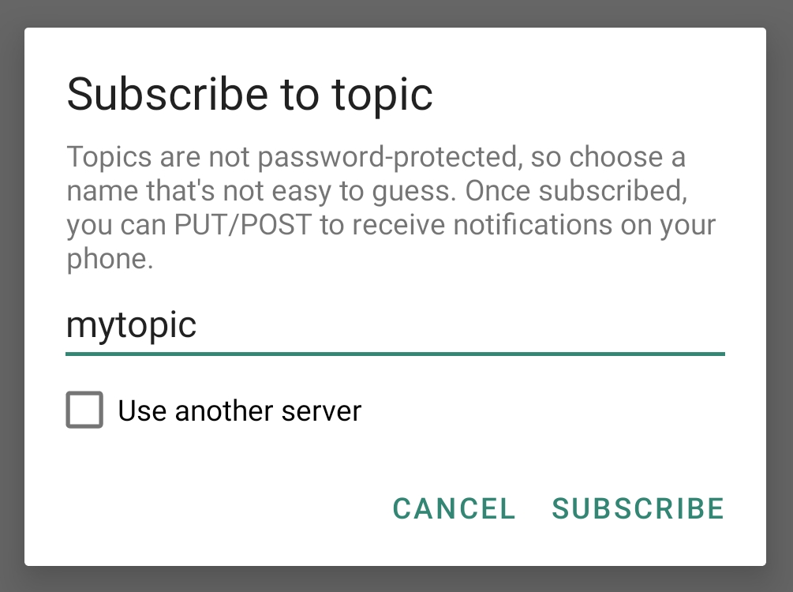

# Getting started
ntfy lets you **send push notifications to your phone or desktop via scripts from any computer**, using simple HTTP PUT
or POST requests. I use it to notify myself when scripts fail, or long-running commands complete.

## Step 1: Get the app
<a href="https://play.google.com/store/apps/details?id=io.heckel.ntfy"></a>
<a href="https://f-droid.org/en/packages/io.heckel.ntfy/"></a>
<a href="https://apps.apple.com/us/app/ntfy/id1625396347"></a>

To [receive notifications on your phone](subscribe/phone.md), install the app, either via Google Play or F-Droid.
Once installed, open it and subscribe to a topic of your choosing. Topics don't have to explicitly be created, so just
pick a name and use it later when you [publish a message](publish.md). Note that **topic names are public, so it's wise 
to choose something that cannot be guessed easily.** 

For this guide, we'll just use `mytopic` as our topic name:

<figure markdown>
  { width=500 }
  <figcaption>Creating/adding your first topic</figcaption>
</figure>

That's it. After you tap "Subscribe", the app is listening for new messages on that topic.

## Step 2: Send a message
Now let's [send a message](publish.md) to our topic. It's easy in every language, since we're just using HTTP PUT/POST,
or with the [ntfy CLI](install.md). The message is in the request body. Here's an example showing how to publish a 
simple message using a POST request:

=== "Command line (curl)"
    ```
    curl -d "Backup successful 😀" ntfy.sh/mytopic
    ```

=== "ntfy CLI"
    ```
    ntfy publish mytopic "Backup successful 😀"
    ```

=== "HTTP"
    ``` http
    POST /mytopic HTTP/1.1
    Host: ntfy.sh
    
    Backup successful 😀
    ```

=== "JavaScript"
    ``` javascript
    fetch('https://ntfy.sh/mytopic', {
        method: 'POST', // PUT works too
        body: 'Backup successful 😀'
    })
    ```

=== "Go"
    ``` go
    http.Post("https://ntfy.sh/mytopic", "text/plain",
       strings.NewReader("Backup successful 😀"))
    ```

=== "Python"
    ``` python
    requests.post("https://ntfy.sh/mytopic",
        data="Backup successful 😀".encode(encoding='utf-8'))
    ```

=== "PHP"
    ``` php-inline
    file_get_contents('https://ntfy.sh/mytopic', false, stream_context_create([
        'http' => [
            'method' => 'POST', // PUT also works
            'header' => 'Content-Type: text/plain',
            'content' => 'Backup successful 😀'
        ]
    ]));
    ```

This will create a notification that looks like this:

<figure markdown>
  { width=500 }
  <figcaption>Android notification</figcaption>
</figure>

That's it. You're all set. Go play and read the rest of the docs. I highly recommend reading at least the page on
[publishing messages](publish.md), as well as the detailed page on the [Android/iOS app](subscribe/phone.md).

Here's another video showing the entire process:

<figure>
  <video controls muted autoplay loop width="650" src="static/img/android-video-overview.mp4"></video>
  <figcaption>Sending push notifications to your Android phone</figcaption>
</figure>


