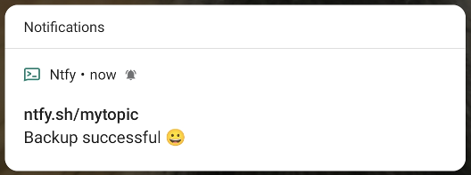
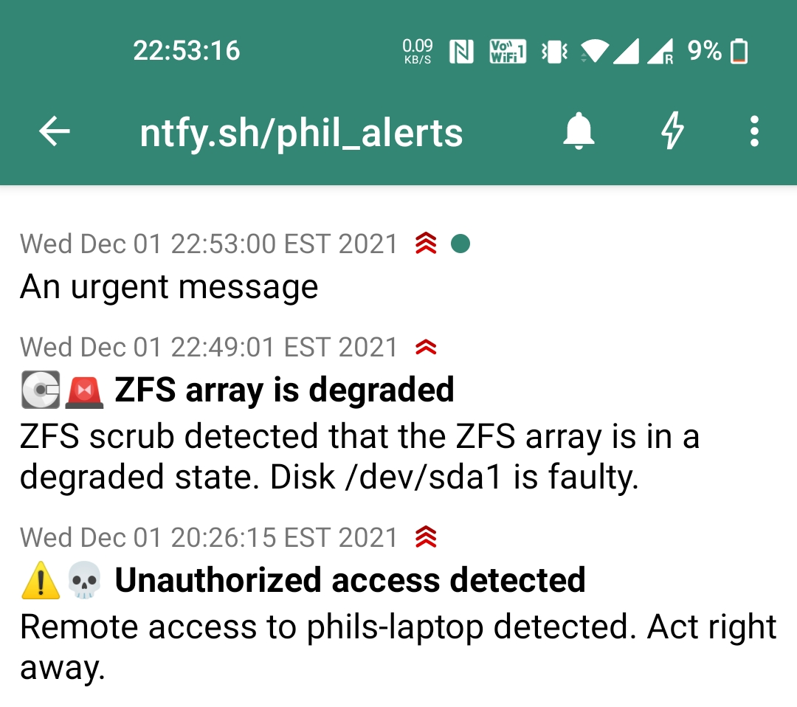
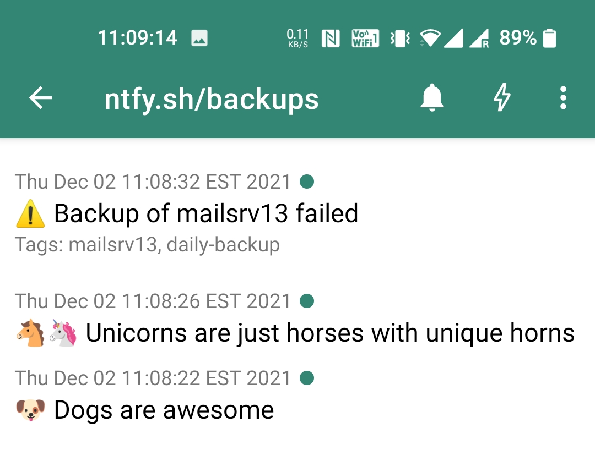

# Publishing
Publishing messages can be done via HTTP PUT or POST. Topics are created on the fly by subscribing or publishing to them.
Because there is no sign-up, **the topic is essentially a password**, so pick something that's not easily guessable.

Here's an example showing how to publish a simple message using a POST request:

=== "Command line (curl)"
    ```
    curl -d "Backup successful 😀" ntfy.sh/mytopic
    ```

=== "HTTP"
    ``` http
    POST /mytopic HTTP/1.1
    Host: ntfy.sh

    Backup successful 😀
    ```
=== "JavaScript"
    ``` javascript
    fetch('https://ntfy.sh/mytopic', {
      method: 'POST', // PUT works too
      body: 'Backup successful 😀'
    })
    ```

=== "Go"
    ``` go
    http.Post("https://ntfy.sh/mytopic", "text/plain",
        strings.NewReader("Backup successful 😀"))
    ```

=== "PHP"
    ``` php-inline
    file_get_contents('https://ntfy.sh/mytopic', false, stream_context_create([
        'http' => [
            'method' => 'POST', // PUT also works
            'header' => 'Content-Type: text/plain',
            'content' => 'Backup successful 😀'
        ]
    ]));
    ```

If you have the [Android app](subscribe/phone.md) installed on your phone, this will create a notification that looks like this:

<figure markdown>
  { width=500 }
  <figcaption>Android notification</figcaption>
</figure>

There are more features related to publishing messages: You can set a [notification priority](#message-priority), 
a [title](#message-title), and [tag messages](#tags-emojis) 🥳 🎉. Here's an example that uses some of them at together:

=== "Command line (curl)"
    ```
    curl \
      -H "Title: Unauthorized access detected" \
      -H "Priority: urgent" \
      -H "Tags: warning,skull" \
      -d "Remote access to phils-laptop detected. Act right away." \
      ntfy.sh/phil_alerts
    ```

=== "HTTP"
    ``` http
    POST /phil_alerts HTTP/1.1
    Host: ntfy.sh
    Title: Unauthorized access detected
    Priority: urgent
    Tags: warning,skull
    
    Remote access to phils-laptop detected. Act right away.
    ```

=== "JavaScript"
    ``` javascript
    fetch('https://ntfy.sh/phil_alerts', {
        method: 'POST', // PUT works too
        body: 'Remote access to phils-laptop detected. Act right away.',
        headers: {
            'Title': 'Unauthorized access detected',
            'Priority': 'urgent',
            'Tags': 'warning,skull'
        }
    })
    ```

=== "Go"
    ``` go
	req, _ := http.NewRequest("POST", "https://ntfy.sh/phil_alerts",
		strings.NewReader("Remote access to phils-laptop detected. Act right away."))
	req.Header.Set("Title", "Unauthorized access detected")
	req.Header.Set("Priority", "urgent")
	req.Header.Set("Tags", "warning,skull")
	http.DefaultClient.Do(req)
    ```

=== "PHP"
    ``` php-inline
    file_get_contents('https://ntfy.sh/phil_alerts', false, stream_context_create([
        'http' => [
            'method' => 'POST', // PUT also works
            'header' =>
                "Content-Type: text/plain\r\n" .
                "Title: Unauthorized access detected\r\n" .
                "Priority: urgent\r\n" .
                "Tags: warning,skull",
            'content' => 'Remote access to phils-laptop detected. Act right away.'
        ]
    ]));
    ```

<figure markdown>
  { width=500 }
  <figcaption>Urgent notification with tags and title</figcaption>
</figure>

## Message title
The notification title is typically set to the topic short URL (e.g. `ntfy.sh/mytopic`). To override the title, 
you can set the `X-Title` header (or any of its aliases: `Title`, `ti`, or `t`).

=== "Command line (curl)"
    ```
    curl -H "X-Title: Dogs are better than cats" -d "Oh my ..." ntfy.sh/controversial
    curl -H "Title: Dogs are better than cats" -d "Oh my ..." ntfy.sh/controversial
    curl -H "t: Dogs are better than cats" -d "Oh my ..." ntfy.sh/controversial
    ```

=== "HTTP"
    ``` http
    POST /controversial HTTP/1.1
    Host: ntfy.sh
    Title: Dogs are better than cats
    
    Oh my ...
    ```

=== "JavaScript"
    ``` javascript
    fetch('https://ntfy.sh/controversial', {
        method: 'POST',
        body: 'Oh my ...',
        headers: { 'Title': 'Dogs are better than cats' }
    })
    ```

=== "Go"
    ``` go
    req, _ := http.NewRequest("POST", "https://ntfy.sh/controversial", strings.NewReader("Oh my ..."))
    req.Header.Set("Title", "Dogs are better than cats")
    http.DefaultClient.Do(req)
    ```

=== "PHP"
    ``` php-inline
    file_get_contents('https://ntfy.sh/controversial', false, stream_context_create([
        'http' => [
            'method' => 'POST',
            'header' =>
                "Content-Type: text/plain\r\n" .
                "Title: Dogs are better than cats",
            'content' => 'Oh my ...'
        ]
    ]));
    ```

<figure markdown>
  { width=500 }
  <figcaption>Detail view of notification with title</figcaption>
</figure>

## Message priority
All messages have a priority, which defines how urgently your phone notifies you. You can set custom
notification sounds and vibration patterns on your phone to map to these priorities (see [Android config](subscribe/phone.md)).

The following priorities exist:

| Priority | Icon | ID | Name | Description |
|---|---|---|---|---|
| Max priority |  | `5` | `max`/`urgent` | Really long vibration bursts, default notification sound with a pop-over notification. |
| High priority |  | `4` | `high` | Long vibration burst, default notification sound with a pop-over notification. |
| **Default priority** | *(none)* | `3` | `default` | Short default vibration and sound. Default notification behavior. |
| Low priority |  |`2` | `low` | No vibration or sound. Notification will not visibly show up until notification drawer is pulled down. |
| Min priority |  | `1` | `min` | No vibration or sound. The notification will be under the fold in "Other notifications". |

You can set the priority with the header `X-Priority` (or any of its aliases: `Priority`, `prio`, or `p`).

=== "Command line (curl)"
    ```
    curl -H "X-Priority: 5" -d "An urgent message" ntfy.sh/phil_alerts
    curl -H "Priority: low" -d "Low priority message" ntfy.sh/phil_alerts
    curl -H p:4 -d "A high priority message" ntfy.sh/phil_alerts
    ```

=== "HTTP"
    ``` http
    POST /phil_alerts HTTP/1.1
    Host: ntfy.sh
    Priority: 5

    An urgent message
    ```

=== "JavaScript"
    ``` javascript
    fetch('https://ntfy.sh/phil_alerts', {
        method: 'POST',
        body: 'An urgent message',
        headers: { 'Priority': '5' }
    })
    ```

=== "Go"
    ``` go
    req, _ := http.NewRequest("POST", "https://ntfy.sh/phil_alerts", strings.NewReader("An urgent message"))
    req.Header.Set("Priority", "5")
    http.DefaultClient.Do(req)
    ```

=== "PHP"
    ``` php-inline
    file_get_contents('https://ntfy.sh/phil_alerts', false, stream_context_create([
        'http' => [
            'method' => 'POST',
            'header' =>
                "Content-Type: text/plain\r\n" .
                "Priority: 5",
            'content' => 'An urgent message'
        ]
    ]));
    ```

<figure markdown>
  { width=500 }
  <figcaption>Detail view of priority notifications</figcaption>
</figure>

## Tags & emojis 🥳 🎉
You can tag messages with emojis and other relevant strings:

* **Emojis**: If a tag matches an [emoji short code](emojis.md), it'll be converted to an emoji and prepended 
  to title or message.
* **Other tags:** If a tag doesn't match, it will be listed below the notification. 

This feature is useful for things like warnings (⚠️, ️🚨, or 🚩), but also to simply tag messages otherwise (e.g. script 
names, hostnames, etc.). Use [the emoji short code list](emojis.md) to figure out what tags can be converted to emojis. 
Here's an **excerpt of emojis** I've found very useful in alert messages:

<table class="remove-md-box"><tr>
<td>
    <table><thead><tr><th>Tag</th><th>Emoji</th></tr></thead><tbody>
    <tr><td><code>+1</code></td><td>👍️</td></tr>
    <tr><td><code>partying_face</code></td><td>🥳</td></tr>
    <tr><td><code>tada</code></td><td>🎉</td></tr>
    <tr><td><code>heavy_check_mark</code></td><td>✔️</td></tr>
    <tr><td><code>loudspeaker</code></td><td>📢</td></tr>
    <tr><td>...</td><td>...</td></tr>
    </tbody></table>
</td>
<td>
    <table><thead><tr><th>Tag</th><th>Emoji</th></tr></thead><tbody> 
    <tr><td><code>-1</code></td><td>👎️</td></tr>
    <tr><td><code>warning</code></td><td>⚠️</td></tr>
    <tr><td><code>rotating_light</code></td><td>️🚨</td></tr>
    <tr><td><code>triangular_flag_on_post</code></td><td>🚩</td></tr>
    <tr><td><code>skull</code></td><td>💀</td></tr>
    <tr><td>...</td><td>...</td></tr>
    </tbody></table>
</td>
<td>
    <table><thead><tr><th>Tag</th><th>Emoji</th></tr></thead><tbody>
    <tr><td><code>facepalm</code></td><td>🤦</td></tr>
    <tr><td><code>no_entry</code></td><td>⛔</td></tr>
    <tr><td><code>no_entry_sign</code></td><td>🚫</td></tr>
    <tr><td><code>cd</code></td><td>💿</td></tr> 
    <tr><td><code>computer</code></td><td>💻</td></tr>
    <tr><td>...</td><td>...</td></tr>
    </tbody></table>
</td>
</tr></table>

You can set tags with the `X-Tags` header (or any of its aliases: `Tags`, `tag`, or `ta`). Specify multiple tags by separating
them with a comma, e.g. `tag1,tag2,tag3`.

=== "Command line (curl)"
    ```
    curl -H "X-Tags: warning,mailsrv13,daily-backup" -d "Backup of mailsrv13 failed" ntfy.sh/backups
    curl -H "Tags: horse,unicorn" -d "Unicorns are just horses with unique horns" ntfy.sh/backups
    curl -H ta:dog -d "Dogs are awesome" ntfy.sh/backups
    ```

=== "HTTP"
    ``` http
    POST /backups HTTP/1.1
    Host: ntfy.sh
    Tags: warning,mailsrv13,daily-backup
    
    Backup of mailsrv13 failed
    ```

=== "JavaScript"
    ``` javascript
    fetch('https://ntfy.sh/backups', {
        method: 'POST',
        body: 'Backup of mailsrv13 failed',
        headers: { 'Tags': 'warning,mailsrv13,daily-backup' }
    })
    ```

=== "Go"
    ``` go
    req, _ := http.NewRequest("POST", "https://ntfy.sh/backups", strings.NewReader("Backup of mailsrv13 failed"))
    req.Header.Set("Tags", "warning,mailsrv13,daily-backup")
    http.DefaultClient.Do(req)
    ```

=== "PHP"
    ``` php-inline
    file_get_contents('https://ntfy.sh/backups', false, stream_context_create([
        'http' => [
            'method' => 'POST',
            'header' =>
                "Content-Type: text/plain\r\n" .
                "Tags: warning,mailsrv13,daily-backup",
            'content' => 'Backup of mailsrv13 failed'
        ]
    ]));
    ```

<figure markdown>
  { width=500 }
  <figcaption>Detail view of notifications with tags</figcaption>
</figure>

## Message caching
By default, the ntfy server caches messages on disk for 12 hours (see [message caching](config.md#message-cache)), so
all messages you publish are stored server-side for a little while. The reason for this is to overcome temporary 
client-side network disruptions, but arguably this feature also may raise privacy concerns.

To avoid messages being cached server-side entirely, you can set `X-Cache` header (or its alias: `Cache`) to `no`. 
This will make sure that your message is not cached on the server, even if server-side caching is enabled. Messages
are still delivered to connected subscribers, but [`since=`](subscribe/api.md#fetching-cached-messages) and 
[`poll=1`](subscribe/api.md#polling) won't return the message anymore.

=== "Command line (curl)"
    ```
    curl -H "X-Cache: no" -d "This message won't be stored server-side" ntfy.sh/mytopic
    curl -H "Cache: no" -d "This message won't be stored server-side" ntfy.sh/mytopic
    ```

=== "HTTP"
    ``` http
    POST /mytopic HTTP/1.1
    Host: ntfy.sh
    Cache: no

    This message won't be stored server-side
    ```

=== "JavaScript"
    ``` javascript
    fetch('https://ntfy.sh/mytopic', {
        method: 'POST',
        body: 'This message won't be stored server-side',
        headers: { 'Cache': 'no' }
    })
    ```

=== "Go"
    ``` go
    req, _ := http.NewRequest("POST", "https://ntfy.sh/mytopic", strings.NewReader("This message won't be stored server-side"))
    req.Header.Set("Cache", "no")
    http.DefaultClient.Do(req)
    ```

=== "PHP"
    ``` php-inline
    file_get_contents('https://ntfy.sh/mytopic', false, stream_context_create([
        'http' => [
            'method' => 'POST',
            'header' =>
                "Content-Type: text/plain\r\n" .
                "Cache: no",
            'content' => 'This message won't be stored server-side'
        ]
    ]));
    ```
