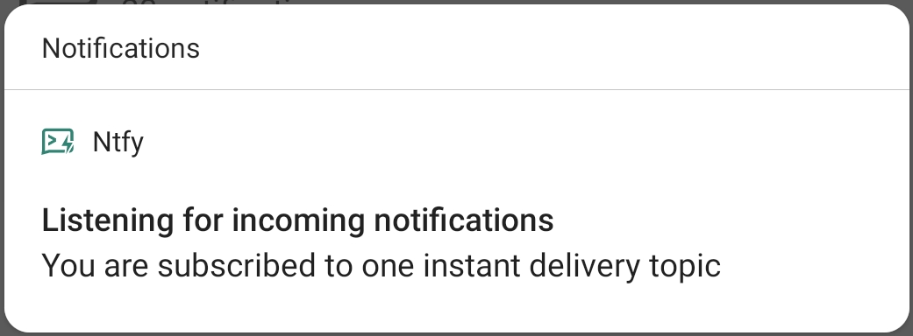

# Subscribe from your phone
You can use the [ntfy Android App](https://play.google.com/store/apps/details?id=io.heckel.ntfy) to receive 
notifications directly on your phone. Just like the server, this app is also [open source](https://github.com/binwiederhier/ntfy-android).
Since I don't have an iPhone or a Mac, I didn't make an iOS app yet. I'd be awesome if [someone else could help out](https://github.com/binwiederhier/ntfy/issues/4).

## Android
You can get the Android app from both [Google Play](https://play.google.com/store/apps/details?id=io.heckel.ntfy) and 
from [F-Droid](https://f-droid.org/en/packages/io.heckel.ntfy/). Both are largely identical, with the one exception that
the F-Droid flavor does not use Firebase.

### Instant delivery
Instant delivery is allows you to receive messages on your phone instantly, **even when your phone is in doze mode**, i.e. 
when the screen turns off, and you leave it on the desk for a while. This is achieved with a foreground service, which 
you'll see as a permanent notification that looks like this:

<figure markdown>
  { width=500 }
  <figcaption>Instant delivery foreground notification</figcaption>
</figure>

Android does not allow you to dismiss this notification, unless you turn off the notification channel in the settings.
To do so, long-press on the foreground notification (screenshot above) and navigate to the settings. Then toggle the 
"Subscription Service" off:

<figure markdown>
  { width=500 }
  <figcaption>Turning off the persistent instant delivery notification</figcaption>
</figure>

### Limitations without instant delivery
Without instant delivery, **messages may arrive with a significant delay** (sometimes many minutes, or even hours later). If you've ever picked up your phone and 
suddenly had 10 messages that were sent long before you know what I'm talking about.

The reason for this is [Firebase Cloud Messaging (FCM)](https://firebase.google.com/docs/cloud-messaging). FCM is the 
*only* Google approved way to send push messages to Android devices, and it's what pretty much all apps use to deliver push 
notifications. Firebase is overall pretty bad at delivering messages in time, but on Android, most apps are stuck with it.

The ntfy Android app uses Firebase only for the main host `ntfy.sh`, and only in the Google Play flavor of the app.
It won't use Firebase for any self-hosted servers, and not at all in the the F-Droid flavor.

## iPhone/iOS
I almost feel devious for putting the *Download on the App Store* button on this page. Currently, there is no iOS app
for ntfy, but it's in the works. You can track the status on GitHub.

