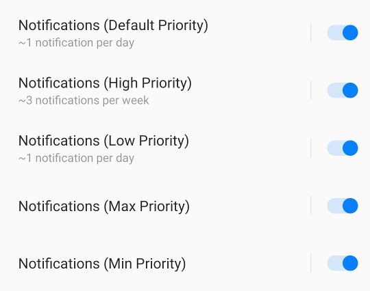
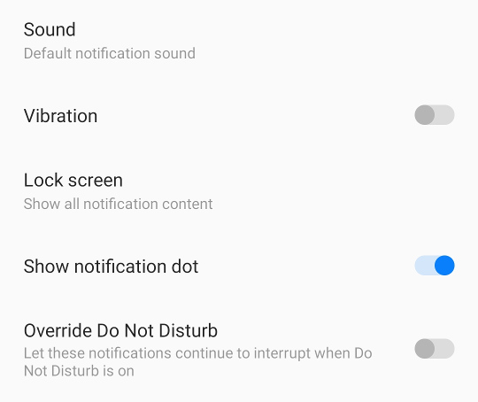

# Subscribe from your phone
You can use the ntfy [Android App](https://play.google.com/store/apps/details?id=io.heckel.ntfy) or [iOS app](https://apps.apple.com/us/app/ntfy/id1625396347)
to receive notifications directly on your phone. Just like the server, this app is also open source, and the code is available
on GitHub ([Android](https://github.com/binwiederhier/ntfy-android), [iOS](https://github.com/binwiederhier/ntfy-ios)). Feel free to 
contribute, or [build your own](../develop.md).

You can get the Android app from both [Google Play](https://play.google.com/store/apps/details?id=io.heckel.ntfy) and 
from [F-Droid](https://f-droid.org/en/packages/io.heckel.ntfy/). Both are largely identical, with the one exception that
the F-Droid flavor does not use Firebase. The iOS app can be downloaded from the [App Store](https://apps.apple.com/us/app/ntfy/id1625396347).

Alternatively, you may also want to consider using the **[progressive web app (PWA)](pwa.md)** instead of the native app.
The PWA is a website that you can add to your home screen, and it will behave just like a native app.

## Overview
A picture is worth a thousand words. Here are a few screenshots showing what the app looks like. It's all pretty
straight forward. You can add topics and as soon as you add them, you can [publish messages](../publish.md) to them.

    
    
    
    
    
    

If those screenshots are still not enough, here's a video:

<figure>
  <video controls muted autoplay loop width="650" src="../../static/img/android-video-overview.mp4"></video>
  <figcaption>Sending push notifications to your Android phone</figcaption>
</figure>

## Message priority
_Supported on:_ :material-android: :material-apple:

When you [publish messages](../publish.md#message-priority) to a topic, you can **define a priority**. This priority defines
how urgently Android will notify you about the notification, and whether they make a sound and/or vibrate.

By default, messages with default priority or higher (>= 3) will vibrate and make a sound. Messages with high or urgent
priority (>= 4) will also show as pop-over, like so:

<figure markdown>
  { width=500 }
  <figcaption>High and urgent notifications show as pop-over</figcaption>
</figure>

You can change these settings in Android by long-pressing on the app, and tapping "Notifications", or from the "Settings"
menu under "Channel settings". There is one notification channel for each priority:

<figure markdown>
  { width=500 }
  <figcaption>Per-priority channels</figcaption>
</figure>

Per notification channel, you can configure a **channel-specific sound**, whether to **override the Do Not Disturb (DND)**
setting, and other settings such as popover or notification dot:

<figure markdown>
  { width=500 }
  <figcaption>Per-priority sound/vibration settings</figcaption>
</figure>

## Instant delivery
_Supported on:_ :material-android:

Instant delivery allows you to receive messages on your phone instantly, **even when your phone is in doze mode**, i.e. 
when the screen turns off, and you leave it on the desk for a while. This is achieved with a foreground service, which 
you'll see as a permanent notification that looks like this:

<figure markdown>
  { width=500 }
  <figcaption>Instant delivery foreground notification</figcaption>
</figure>

Android does not allow you to dismiss this notification, unless you turn off the notification channel in the settings.
To do so, long-press on the foreground notification (screenshot above) and navigate to the settings. Then toggle the 
"Subscription Service" off:

<figure markdown>
  { width=500 }
  <figcaption>Turning off the persistent instant delivery notification</figcaption>
</figure>

**Limitations without instant delivery**: Without instant delivery, **messages may arrive with a significant delay** 
(sometimes many minutes, or even hours later). If you've ever picked up your phone and 
suddenly had 10 messages that were sent long before you know what I'm talking about.

The reason for this is [Firebase Cloud Messaging (FCM)](https://firebase.google.com/docs/cloud-messaging). FCM is the 
*only* Google approved way to send push messages to Android devices, and it's what pretty much all apps use to deliver push 
notifications. Firebase is overall pretty bad at delivering messages in time, but on Android, most apps are stuck with it.

The ntfy Android app uses Firebase only for the main host `ntfy.sh`, and only in the Google Play flavor of the app.
It won't use Firebase for any self-hosted servers, and not at all in the the F-Droid flavor.

## Share to topic
_Supported on:_ :material-android:

You can share files to a topic using Android's "Share" feature. This works in almost any app that supports sharing files
or text, and it's useful for sending yourself links, files or other things. The feature remembers a few of the last topics
you shared content to and lists them at the bottom.

The feature is pretty self-explanatory, and one picture says more than a thousand words. So here are two pictures:

    
    

## ntfy:// links
_Supported on:_ :material-android:

The ntfy Android app supports deep linking directly to topics. This is useful when integrating with [automation apps](#automation-apps)
such as [MacroDroid](https://play.google.com/store/apps/details?id=com.arlosoft.macrodroid) or [Tasker](https://play.google.com/store/apps/details?id=net.dinglisch.android.taskerm),
or to simply directly link to a topic from a mobile website. 

!!! info
    Android deep linking of http/https links is very brittle and limited, which is why something like `https://<host>/<topic>/subscribe` is 
    **not possible**, and instead `ntfy://` links have to be used. More details in [issue #20](https://github.com/binwiederhier/ntfy/issues/20).

**Supported link formats:**

| Link format                                                                   | Example                                   | Description                                                                                                                                                                                         |
|-------------------------------------------------------------------------------|-------------------------------------------|-----------------------------------------------------------------------------------------------------------------------------------------------------------------------------------------------------|
| `ntfy://<host>/<topic>`              | `ntfy://ntfy.sh/mytopic`                  | Directly opens the Android app detail view for the given topic and server. Subscribes to the topic if not already subscribed. This is equivalent to the web view `https://ntfy.sh/mytopic` (HTTPS!) |
| `ntfy://<host>/<topic>?secure=false` | `ntfy://example.com/mytopic?secure=false` | Same as above, except that this will use HTTP instead of HTTPS as topic URL. This is equivalent to the web view `http://example.com/mytopic` (HTTP!)                                                |

## Integrations

### UnifiedPush
_Supported on:_ :material-android:

[UnifiedPush](https://unifiedpush.org) is a standard for receiving push notifications without using the Google-owned
[Firebase Cloud Messaging (FCM)](https://firebase.google.com/docs/cloud-messaging) service. It puts push notifications 
in the control of the user. ntfy can act as a **UnifiedPush distributor**, forwarding messages to apps that support it. 

To use ntfy as a distributor, simply select it in one of the [supported apps](https://unifiedpush.org/users/apps/). 
That's it. It's a one-step installation 😀. If desired, you can select your own [selfhosted ntfy server](../install.md)
to handle messages. Here's an example with [FluffyChat](https://fluffychat.im/):

    
    
    

### Automation apps
_Supported on:_ :material-android:

The ntfy Android app integrates nicely with automation apps such as [MacroDroid](https://play.google.com/store/apps/details?id=com.arlosoft.macrodroid)
or [Tasker](https://play.google.com/store/apps/details?id=net.dinglisch.android.taskerm). Using Android intents, you can
**react to incoming messages**, as well as **send messages**.

#### React to incoming messages
To react on incoming notifications, you have to register to intents with the `io.heckel.ntfy.MESSAGE_RECEIVED` action (see
[code for details](https://github.com/binwiederhier/ntfy-android/blob/main/app/src/main/java/io/heckel/ntfy/msg/BroadcastService.kt)).
Here's an example using [MacroDroid](https://play.google.com/store/apps/details?id=com.arlosoft.macrodroid)
and [Tasker](https://play.google.com/store/apps/details?id=net.dinglisch.android.taskerm), but any app that can catch 
broadcasts is supported:

    
    
    
    
    
    
    

For MacroDroid, be sure to type in the package name `io.heckel.ntfy`, otherwise intents may be silently swallowed.
If you're using topics to drive automation, you'll likely want to mute the topic in the ntfy app. This will prevent 
notification popups:

<figure markdown>
  { width=500 }
  <figcaption>Muting notifications to prevent popups</figcaption>
</figure>

Here's a list of extras you can access. Most likely, you'll want to filter for `topic` and react on `message`:

| Extra name           | Type                         | Example                                  | Description                                                                        |
|----------------------|------------------------------|------------------------------------------|------------------------------------------------------------------------------------|
| `id`                 | *String*                     | `bP8dMjO8ig`                             | Randomly chosen message identifier (likely not very useful for task automation)    |
| `base_url`           | *String*                     | `https://ntfy.sh`                        | Root URL of the ntfy server this message came from                                 |
| `topic` ❤️           | *String*                     | `mytopic`                                | Topic name; **you'll likely want to filter for a specific topic**                  |
| `muted`              | *Boolean*                    | `true`                                   | Indicates whether the subscription was muted in the app                            |
| `muted_str`          | *String (`true` or `false`)* | `true`                                   | Same as `muted`, but as string `true` or `false`                                   |
| `time`               | *Int*                        | `1635528741`                             | Message date time, as Unix time stamp                                              |
| `title`              | *String*                     | `Some title`                             | Message [title](../publish.md#message-title); may be empty if not set              |
| `message` ❤️         | *String*                     | `Some message`                           | Message body; **this is likely what you're interested in**                         |
| `message_bytes`      | *ByteArray*                  | `(binary data)`                          | Message body as binary data                                                        |
| `encoding`️          | *String*                     | -                                        | Message encoding (empty or "base64")                                               |
| `tags`               | *String*                     | `tag1,tag2,..`                           | Comma-separated list of [tags](../publish.md#tags-emojis)                          |
| `tags_map`           | *String*                     | `0=tag1,1=tag2,..`                       | Map of tags to make it easier to map first, second, ... tag                        |
| `priority`           | *Int (between 1-5)*          | `4`                                      | Message [priority](../publish.md#message-priority) with 1=min, 3=default and 5=max |
| `click`              | *String*                     | `https://google.com`                     | [Click action](../publish.md#click-action) URL, or empty if not set                |
| `attachment_name`    | *String*                     | `attachment.jpg`                         | Filename of the attachment; may be empty if not set                                |
| `attachment_type`    | *String*                     | `image/jpeg`                             | Mime type of the attachment; may be empty if not set                               |
| `attachment_size`    | *Long*                       | `9923111`                                | Size in bytes of the attachment; may be zero if not set                            |
| `attachment_expires` | *Long*                       | `1655514244`                             | Expiry date as Unix timestamp of the attachment URL; may be zero if not set        |
| `attachment_url`     | *String*                     | `https://ntfy.sh/file/afUbjadfl7ErP.jpg` | URL of the attachment; may be empty if not set                                     |

#### Send messages using intents
To send messages from other apps (such as [MacroDroid](https://play.google.com/store/apps/details?id=com.arlosoft.macrodroid)
and [Tasker](https://play.google.com/store/apps/details?id=net.dinglisch.android.taskerm)), you can 
broadcast an intent with the `io.heckel.ntfy.SEND_MESSAGE` action. The ntfy Android app will forward the intent as a HTTP
POST request to [publish a message](../publish.md). This is primarily useful for apps that do not support HTTP POST/PUT
(like MacroDroid). In Tasker, you can simply use the "HTTP Request" action, which is a little easier and also works if 
ntfy is not installed.

Here's what that looks like:

    
    
    
    
    

The following intent extras are supported when for the intent with the `io.heckel.ntfy.SEND_MESSAGE` action:

| Extra name   | Required | Type                          | Example           | Description                                                                        |
|--------------|----------|-------------------------------|-------------------|------------------------------------------------------------------------------------|
| `base_url`   | -        | *String*                      | `https://ntfy.sh` | Root URL of the ntfy server this message came from, defaults to `https://ntfy.sh`  |
| `topic` ❤️   | ✔        | *String*                      | `mytopic`         | Topic name; **you must set this**                                                  |
| `title`      | -        | *String*                      | `Some title`      | Message [title](../publish.md#message-title); may be empty if not set              |
| `message` ❤️ | ✔        | *String*                      | `Some message`    | Message body; **you must set this**                                                |
| `tags`       | -        | *String*                      | `tag1,tag2,..`    | Comma-separated list of [tags](../publish.md#tags-emojis)                          |
| `priority`   | -        | *String or Int (between 1-5)* | `4`               | Message [priority](../publish.md#message-priority) with 1=min, 3=default and 5=max |
